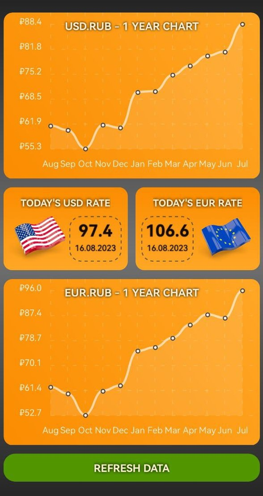

### Code Climate status:

## USD-EUR

### Mobile application to check actual usd.rub, eur.rub rates, and historical values (for 1 year)

## Download Link

https://drive.google.com/file/d/1Mo9x4_XTtCtqjnF4KPIh_CHRfZiplnO8/view?usp=drive_link

## Application screenshot

## Apllication's work video

https://github.com/DomnitskiyOleg/usd.eur-mobile.app/assets/119673815/ade251dd-3d94-419f-acfa-b581a491276c
